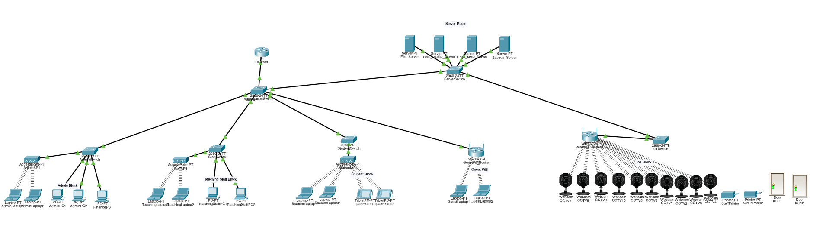
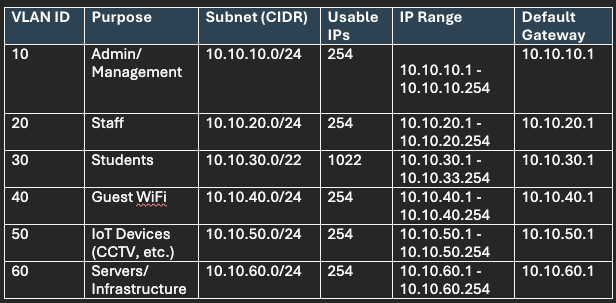
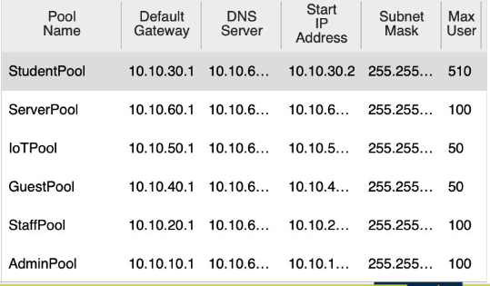
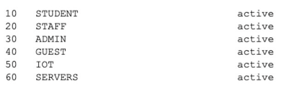

# Secure Network Design – Holmview Primary School (Capstone Project)

This repository showcases the technical artefacts and configurations I developed as part of the Holmview Primary School Secure Network Infrastructure Project, a simulated real-world implementation designed to address the needs of a modern school institution. The project involved building a secure, segmented, and scalable campus-wide network using Cisco Packet Tracer, incorporating both wired and wireless access, VLAN-based segmentation, IoT security controls, and server integration.

As the designated Wi-Fi and IoT Infrastructure Engineer, I was responsible for leading and implementing all technical elements related to the school’s end-to-end network deployment.
My contributions included:
	•	Designing the complete network topology in Cisco Packet Tracer, including physical and logical layout
	•	Developing the IP addressing schema and subnetting plans for efficient routing and scalability
	•	Creating and configuring VLANs (Admin, Staff, Students, IoT, Guest, and Servers) with proper segmentation
	•	Building DHCP pool configurations for each VLAN using centralised DHCP servers
	•	Deploying wireless access points with custom SSIDs and VLAN mapping for each network zone
	•	Integrating IoT devices including smart CCTV, automated door locks, and networked printers within the IoT VLAN
	•	Ensuring secure access controls between VLANs via access control logic and static routing

---

## My Technical Contributions

### 1.  Full Network Topology Design  
I built and logically arranged all networking devices, including core switches, access switches, routers, wireless access points, servers, PCs, printers, IoT cameras, and smart door devices.

**Screenshot:** 

---

### 2. IP Addressing and Subnetting Table  
I planned and implemented the full IP addressing scheme using CIDR notation and subnetting best practices for 6 VLANs.

- Subnet sizes calculated based on host requirements  
- Default gateways assigned for each VLAN  
- CIDR notation used for efficiency  

**Screenshot:** 

---

### 3. DHCP Pool Configuration  
I configured 6 separate DHCP pools in the router to dynamically assign IP addresses within their respective subnets. Each pool includes:

- Correct default gateway  
- DNS server configuration  
- Subnet mask  
- Maximum users  

** Screenshot:** 

---

### 4. Wireless Network SSIDs & Signal  
I configured 5 separate wireless networks (SSIDs) for Admin, Staff, Students, Guests, and IoT devices.  
I assigned these SSIDs to appropriate access points and verified connectivity and signal strength.

**Wireless Networks:**
- AdminNet
- TeachingStaffNet
- StudentNet
- GuestNet
- IoTNet

** Screenshot:** 

---

### 5. VLAN Configuration & Status  
I implemented 6 VLANs with correct VLAN IDs and names:
- VLAN 10: Admin  
- VLAN 20: Staff  
- VLAN 30: Students  
- VLAN 40: Guest WiFi  
- VLAN 50: IoT  
- VLAN 60: Servers

All VLANs were created and verified as "active" using CLI commands.

**Screenshot:** 

---

### 6. Simulation in Cisco Packet Tracer  
All of the above elements were implemented in a working Packet Tracer file, including:
- Full end-to-end connectivity  
- Functional DHCP per VLAN  
- Wireless access  
- Simulated IoT cameras and smart doors  

**File:** `Holmview_Network_Design.pkt`

---

##  GitHub Portfolio Repo

---

## Technologies Used
- Cisco Packet Tracer
- DHCP
- VLANs & Subnetting
- Wireless Network Design
- IoT Device Simulation
- DNS/DHCP Configuration via CLI
